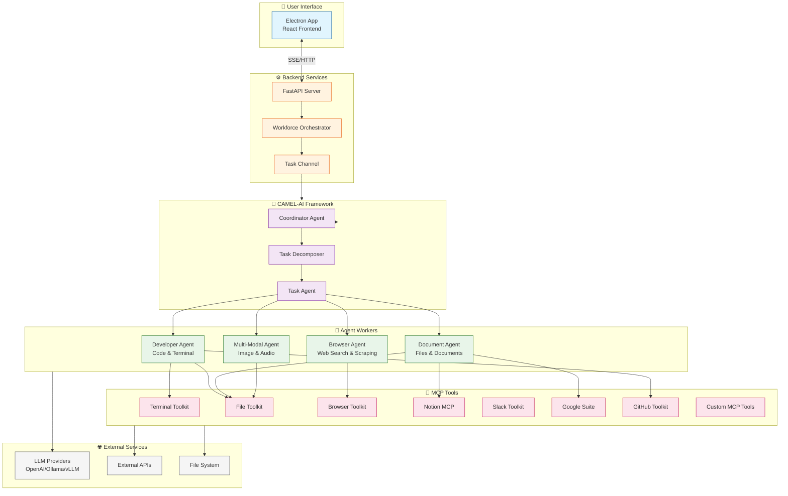
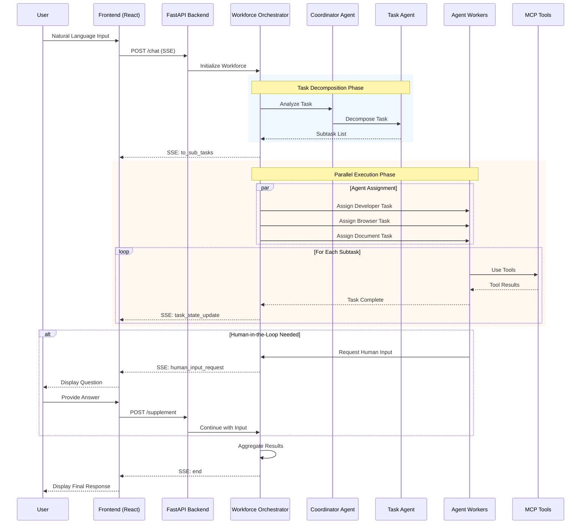

# Eigent - Comprehensive Repository Analysis Report

## Repository Overview

| Attribute | Details |
|-----------|---------|
| **Name** | Eigent |
| **Purpose** | Open Source Cowork Desktop for Multi-Agent Workforce |
| **GitHub** | https://github.com/eigent-ai/eigent |
| **Built On** | CAMEL-AI Framework |
| **License** | Apache License 2.0 |
| **Version** | 0.0.80 |

### Description

**Eigent** is an open-source cowork desktop application that empowers users to build, manage, and deploy custom AI workforces capable of transforming complex workflows into automated tasks. Built on CAMEL-AI's acclaimed open-source project, it introduces a **Multi-Agent Workforce** system that boosts productivity through parallel execution, customization, and privacy protection.

### Key Highlights

- ✅ **100% Open Source** - Complete transparency from day one
- ✅ **Zero Setup** - No technical configuration required
- ✅ **Multi-Agent Coordination** - Handle complex multi-agent workflows
- ✅ **Enterprise Features** - SSO/Access control support
- ✅ **Local Deployment** - Full standalone with local models
- ✅ **MCP Integration** - Model Context Protocol tools support

---

## Architecture

### Monorepo Structure

```
eigent/
├── src/                        # Frontend (React/Electron)
│   ├── api/                    # API layer (HTTP client)
│   ├── components/             # React components
│   │   ├── AddWorker/          # Worker management UI
│   │   ├── BrowserAgentWorkSpace/
│   │   ├── ChatBox/            # Chat interface
│   │   ├── Terminal/           # Terminal UI
│   │   ├── TerminalAgentWrokSpace/
│   │   ├── WorkFlow/           # Workflow visualization
│   │   └── ui/                 # Base UI components
│   ├── pages/                  # Page views
│   │   ├── Dashboard/
│   │   ├── Setting/
│   │   ├── Home.tsx
│   │   ├── Login.tsx
│   │   └── History.tsx
│   ├── store/                  # Zustand state management
│   │   ├── authStore.ts
│   │   ├── chatStore.ts
│   │   ├── globalStore.ts
│   │   ├── projectStore.ts
│   │   └── sidebarStore.ts
│   ├── service/                # Service layer
│   ├── routers/                # Routing configuration
│   ├── hooks/                  # React hooks
│   └── i18n/                   # Internationalization
├── backend/                    # Python FastAPI backend (embedded)
│   └── app/
│       ├── controller/         # API controllers
│       │   ├── chat_controller.py
│       │   ├── model_controller.py
│       │   ├── task_controller.py
│       │   └── tool_controller.py
│       ├── service/            # Business logic
│       │   ├── chat_service.py
│       │   └── task.py
│       ├── model/              # Data models
│       ├── component/          # Core components
│       ├── middleware/         # Request middleware
│       └── utils/              # Utilities
│           ├── agent.py        # Agent definitions
│           ├── workforce.py    # Workforce orchestration
│           └── toolkit/        # Tool integrations
├── electron/                   # Electron main process
│   ├── main/
│   └── preload/
├── server/                     # Local server setup (standalone)
│   └── app/
│       ├── controller/
│       ├── component/
│       ├── middleware/
│       └── model/
├── config/                     # Configuration files
├── docs/                       # Documentation
└── scripts/                    # Build scripts
```

---

## Tech Stack

### Backend

| Component | Technology |
|-----------|------------|
| **Framework** | FastAPI |
| **Package Manager** | uv |
| **Async Server** | Uvicorn |
| **Language** | Python 3.10+ (backend), 3.12+ (server) |
| **Multi-agent Framework** | CAMEL-AI (v0.2.83a9) |
| **Authentication** | OAuth 2.0, Passlib, PyJWT |
| **Database** | SQLModel, SQLAlchemy, Alembic (migrations) |
| **HTTP Client** | HTTPX |
| **AI/ML** | OpenAI SDK, NumPy |

### Frontend

| Component | Technology |
|-----------|------------|
| **Framework** | React 18 |
| **Desktop Framework** | Electron 33 |
| **Language** | TypeScript |
| **Build Tool** | Vite |
| **UI Components** | Radix UI, Tailwind CSS |
| **Animations** | Framer Motion, GSAP, Lottie |
| **State Management** | Zustand |
| **Flow Editor** | React Flow (@xyflow/react) |
| **Icons** | Lucide React |
| **Terminal** | xterm.js |
| **Code Editor** | Monaco Editor |
| **Markdown** | React Markdown + remark-gfm |

### Development Tools

| Category | Tools |
|----------|-------|
| **Testing** | Vitest, Playwright, pytest |
| **Linting** | Ruff (Python) |
| **Type Checking** | TypeScript |
| **Build** | electron-builder |
| **Auto-update** | electron-updater |

---

## Multi-Agent Workforce

### Architecture Diagram



### Pre-defined Agent Workers

| Agent | Role | Capabilities |
|-------|------|--------------|
| **Developer Agent** | Lead Software Engineer | Code execution, terminal commands, file operations, GitHub integration |
| **Browser Agent** | Senior Research Analyst | Web search, content extraction, URL navigation, screenshot capture |
| **Document Agent** | Documentation Specialist | Document creation/management, PDF/DOCX/PPTX/Excel handling, file I/O |
| **Multi-Modal Agent** | Creative Content Specialist | Image/audio/video processing, OCR, transcription, image generation |

### Agent Toolkits

Each agent has access to specialized toolkits:

**Developer Agent Toolkits:**
- `TerminalToolkit` - Shell command execution
- `FileToolkit` - File read/write operations
- `GithubToolkit` - GitHub API integration
- `HybridBrowserToolkit` - Web browsing capabilities
- `SearchToolkit` - Web search functionality

**Browser Agent Toolkits:**
- `HybridBrowserToolkit` - Full web browsing
- `SearchToolkit` - Exa search integration
- `ScreenshotToolkit` - Page screenshots
- `McpSearchToolkit` - MCP-based search

**Document Agent Toolkits:**
- `FileToolkit` - File operations
- `MarkItDownToolkit` - Document conversion
- `PPTXToolkit` - PowerPoint creation
- `ExcelToolkit` - Spreadsheet operations
- `GoogleDriveMCPToolkit` - Google Drive integration

**Multi-Modal Agent Toolkits:**
- `VideoDownloaderToolkit` - Video download
- `ImageAnalysisToolkit` - Image understanding
- `AudioAnalysisToolkit` - Audio transcription
- `OpenAIImageToolkit` - Image generation (DALL-E)

---

## Workforce Coordination

### Task Execution Flow



### Workforce Features

1. **Dynamic Task Decomposition**
   - Intelligent breakdown of complex tasks into subtasks
   - Dependency-aware task ordering
   - Streaming progress updates

2. **Parallel Agent Execution**
   - Multiple agents work simultaneously
   - Task channel for coordination
   - Resource-efficient scheduling

3. **Human-in-the-Loop Escalation**
   - Automatic uncertainty detection
   - Structured question prompts
   - Seamless continuation after input

4. **Failure Handling**
   - Retry strategies for failed tasks
   - Replan capabilities
   - Graceful degradation

---

## MCP Tools Integration

### Built-in MCP Tools

| Category | Tools | Description |
|----------|-------|-------------|
| **Web** | Browser, Search, Screenshot | Web navigation and content extraction |
| **Code** | Terminal, Code Execution | Shell commands and script execution |
| **Productivity** | Notion, Google Suite | Document and workspace integration |
| **Communication** | Slack, Lark | Team messaging integration |
| **Social** | Twitter, LinkedIn, Reddit, WhatsApp | Social media management |
| **File System** | File, Excel, PPTX | Local file operations |
| **Media** | Video, Audio, Image | Multimedia processing |

### Custom Tool Installation

```python
# MCP tool configuration structure
{
    "mcpServers": {
        "custom-tool": {
            "command": "node",
            "args": ["path/to/tool/index.js"],
            "env": {"API_KEY": "..."}
        }
    }
}
```

---

## Product Flow

### Complete Task Execution Pipeline

```
┌─────────────────────────────────────────────────────────────────────┐
│                        USER INPUT (Natural Language)                │
└─────────────────────────────────┬───────────────────────────────────┘
                                  │
                                  ▼
┌─────────────────────────────────────────────────────────────────────┐
│                     QUESTION CONFIRMATION                            │
│  • Determine if complex task or simple question                      │
│  • Route to appropriate handler                                      │
└─────────────────────────────────┬───────────────────────────────────┘
                                  │
                    ┌─────────────┴─────────────┐
                    ▼                           ▼
           ┌───────────────┐           ┌───────────────┐
           │ Simple Query  │           │ Complex Task  │
           │ Direct Answer │           │ Workforce     │
           └───────────────┘           └───────┬───────┘
                                               │
                                               ▼
┌─────────────────────────────────────────────────────────────────────┐
│                      TASK DECOMPOSITION                              │
│  • Parse user intent                                                 │
│  • Analyze available agents                                          │
│  • Create subtask hierarchy with dependencies                        │
└─────────────────────────────────┬───────────────────────────────────┘
                                  │
                                  ▼
┌─────────────────────────────────────────────────────────────────────┐
│                      AGENT SELECTION & ASSIGNMENT                    │
│  ┌─────────────┐  ┌─────────────┐  ┌─────────────┐  ┌─────────────┐ │
│  │  Developer  │  │   Browser   │  │  Document   │  │ Multi-Modal │ │
│  │   Agent     │  │   Agent     │  │   Agent     │  │   Agent     │ │
│  └──────┬──────┘  └──────┬──────┘  └──────┬──────┘  └──────┬──────┘ │
└─────────┼────────────────┼────────────────┼────────────────┼────────┘
          │                │                │                │
          ▼                ▼                ▼                ▼
┌─────────────────────────────────────────────────────────────────────┐
│                      PARALLEL EXECUTION                              │
│  • Execute subtasks concurrently                                     │
│  • Monitor progress via SSE                                          │
│  • Handle tool calls                                                 │
└─────────────────────────────────┬───────────────────────────────────┘
                                  │
                    ┌─────────────┴─────────────┐
                    ▼                           ▼
           ┌───────────────┐           ┌───────────────┐
           │   Success     │           │  Stuck/Error  │
           │   Continue    │           │     HITL      │
           └───────┬───────┘           └───────┬───────┘
                   │                           │
                   │                           ▼
                   │                  ┌───────────────────┐
                   │                  │ Human Input       │
                   │                  │ Request           │
                   │                  └─────────┬─────────┘
                   │                            │
                   │                            ▼
                   │                  ┌───────────────────┐
                   │                  │ User Provides     │
                   │                  │ Guidance          │
                   │                  └─────────┬─────────┘
                   │                            │
                   └────────────┬───────────────┘
                                │
                                ▼
┌─────────────────────────────────────────────────────────────────────┐
│                      RESULT AGGREGATION                              │
│  • Collect all subtask results                                       │
│  • Generate summary                                                  │
│  • Format final response                                             │
└─────────────────────────────────┬───────────────────────────────────┘
                                  │
                                  ▼
┌─────────────────────────────────────────────────────────────────────┐
│                      RESPONSE TO USER                                │
│  • Formatted output                                                  │
│  • Generated artifacts (files, reports)                              │
│  • Task completion status                                            │
└─────────────────────────────────────────────────────────────────────┘
```

---

## Component Communication

### System Architecture

```
┌─────────────────────────────────────────────────────────────────────────┐
│                              USER                                        │
└───────────────────────────────┬─────────────────────────────────────────┘
                                │
                                ▼
┌─────────────────────────────────────────────────────────────────────────┐
│                     ELECTRON APP (Desktop)                               │
│  ┌─────────────────────────────────────────────────────────────────┐   │
│  │                    REACT FRONTEND                                │   │
│  │  ┌─────────────┐  ┌─────────────┐  ┌─────────────┐              │   │
│  │  │  Zustand    │  │  React      │  │  i18next    │              │   │
│  │  │  Store      │  │  Router     │  │  i18n       │              │   │
│  │  └─────────────┘  └─────────────┘  └─────────────┘              │   │
│  │  ┌─────────────────────────────────────────────────────────┐    │   │
│  │  │              COMPONENTS                                  │    │   │
│  │  │  ChatBox | Terminal | WorkFlow | BrowserWorkspace       │    │   │
│  │  └─────────────────────────────────────────────────────────┘    │   │
│  └─────────────────────────────────────────────────────────────────┘   │
│  ┌─────────────────────────────────────────────────────────────────┐   │
│  │                    ELECTRON MAIN PROCESS                         │   │
│  │  • Window Management  • IPC Communication  • Auto Updates        │   │
│  └─────────────────────────────────────────────────────────────────┘   │
└───────────────────────────────┬─────────────────────────────────────────┘
                                │ HTTP/SSE
                                ▼
┌─────────────────────────────────────────────────────────────────────────┐
│                     LOCAL / CLOUD API                                    │
│  ┌─────────────────────────────────────────────────────────────────┐   │
│  │                    FASTAPI SERVER                                │   │
│  │  ┌─────────────┐  ┌─────────────┐  ┌─────────────┐              │   │
│  │  │   Chat      │  │   Model     │  │   Tool      │              │   │
│  │  │ Controller  │  │ Controller  │  │ Controller  │              │   │
│  │  └──────┬──────┘  └─────────────┘  └─────────────┘              │   │
│  │         │                                                        │   │
│  │         ▼                                                        │   │
│  │  ┌─────────────────────────────────────────────────────────┐    │   │
│  │  │              CHAT SERVICE                                │    │   │
│  │  │  • step_solve()  • question_confirm()  • summary_task() │    │   │
│  │  └──────────────────────────┬──────────────────────────────┘    │   │
│  └─────────────────────────────┼────────────────────────────────────┘   │
└────────────────────────────────┼────────────────────────────────────────┘
                                 │
                                 ▼
┌─────────────────────────────────────────────────────────────────────────┐
│                     CAMEL-AI FRAMEWORK                                   │
│  ┌─────────────────────────────────────────────────────────────────┐   │
│  │                    WORKFORCE ORCHESTRATOR                        │   │
│  │  • Task Decomposition  • Agent Coordination  • Failure Handling  │   │
│  └──────────────────────────────┬──────────────────────────────────┘   │
│                                 │                                        │
│  ┌──────────────────────────────┼──────────────────────────────────┐   │
│  │                         AGENTS                                   │   │
│  │  ┌───────────┐  ┌───────────┐  ┌───────────┐  ┌───────────┐    │   │
│  │  │ Developer │  │  Browser  │  │ Document  │  │Multi-Modal│    │   │
│  │  │   Agent   │  │   Agent   │  │   Agent   │  │   Agent   │    │   │
│  │  └─────┬─────┘  └─────┬─────┘  └─────┬─────┘  └─────┬─────┘    │   │
│  └────────┼──────────────┼──────────────┼──────────────┼───────────┘   │
└───────────┼──────────────┼──────────────┼──────────────┼────────────────┘
            │              │              │              │
            ▼              ▼              ▼              ▼
┌───────────────────────────────────────────────────────────────────────────┐
│                          EXTERNAL RESOURCES                                │
│  ┌─────────────┐  ┌─────────────┐  ┌─────────────┐  ┌─────────────┐      │
│  │  Terminal   │  │  Web APIs   │  │ File System │  │ LLM APIs    │      │
│  │  Commands   │  │  (Search,   │  │ (Read/Write)│  │ (OpenAI,    │      │
│  │             │  │   Browse)   │  │             │  │  Ollama)    │      │
│  └─────────────┘  └─────────────┘  └─────────────┘  └─────────────┘      │
└───────────────────────────────────────────────────────────────────────────┘
```

---

## Deployment Options

### 1. Local Deployment (Recommended)

Full standalone deployment with complete control over data:

```bash
# Clone repository
git clone https://github.com/eigent-ai/eigent.git
cd eigent

# Start local server
cd server
./start_server.sh  # or start_server.bat on Windows

# Start frontend
npm install
npm run dev
```

**Features:**
- Local backend server with full API
- Local model integration (vLLM, Ollama, LM Studio)
- Complete isolation from cloud services
- Zero external dependencies

### 2. Cloud-Connected (Quick Start)

Quick preview using cloud backend:

```bash
git clone https://github.com/eigent-ai/eigent.git
cd eigent
npm install
npm run dev
```

**Note:** Requires account registration and connects to Eigent cloud services.

### 3. Enterprise

For organizations requiring maximum security:

- Exclusive features (SSO, custom development)
- Scalable enterprise deployment
- Negotiated SLAs & implementation services
- Contact: info@eigent.ai

### 4. Cloud Version

Managed infrastructure option:

- Instant access to multi-agent workflows
- Managed infrastructure (scaling, updates, maintenance)
- Premium support with priority assistance

---

## Key Features Summary

### Multi-Agent Workforce
- Dynamic task decomposition with parallel execution
- Specialized agent workers for different domains
- Real-time progress monitoring via SSE
- Automatic result aggregation

### Comprehensive Model Support
- **Cloud Providers:** OpenAI, Anthropic, Google, Azure
- **Local Models:** Ollama, vLLM, LM Studio
- Custom endpoint configuration

### MCP Integration
- Built-in tools for common workflows
- Custom tool installation support
- Extensible toolkit architecture

### Human-in-the-Loop
- Automatic uncertainty detection
- Structured human input requests
- Seamless workflow continuation

### Enterprise Ready
- SSO/Access control support
- Local deployment options
- Data privacy protection
- Custom development capabilities

---

## Development

### Prerequisites
- Node.js 18-22
- Python 3.10+ (backend) or 3.12+ (server)
- npm or pnpm

### Scripts

```bash
# Development
npm run dev              # Start development server

# Build
npm run build            # Build for production
npm run build:mac        # Build for macOS
npm run build:win        # Build for Windows

# Testing
npm run test             # Run tests
npm run test:e2e         # Run E2E tests
npm run type-check       # TypeScript check
```

### Backend Development

```bash
cd backend
uv sync                  # Install dependencies
uv run uvicorn main:app  # Start FastAPI server
```

---

## Roadmap

| Topic | Planned Features |
|-------|------------------|
| **Context Engineering** | Prompt caching, system prompt optimization, context compression |
| **Multi-modal Enhancement** | Accurate image understanding, advanced video generation |
| **Multi-agent System** | Fixed workflow support, multi-round conversion |
| **Browser Toolkit** | BrowseCamp integration, benchmark improvements |
| **Document Toolkit** | Dynamic file editing support |
| **Terminal Toolkit** | Terminal-Bench integration |
| **Environment & RL** | Environment design, RL framework integration (VERL, TRL, OpenRLHF) |

---

## Community & Resources

- **Documentation:** https://docs.eigent.ai
- **Discord:** https://discord.com/invite/CNcNpquyDc
- **GitHub Issues:** https://github.com/eigent-ai/eigent/issues
- **Twitter/X:** @Eigent_AI
- **Reddit:** r/CamelAI
- **Contact:** info@eigent.ai

---

*Report generated from Eigent repository analysis*
